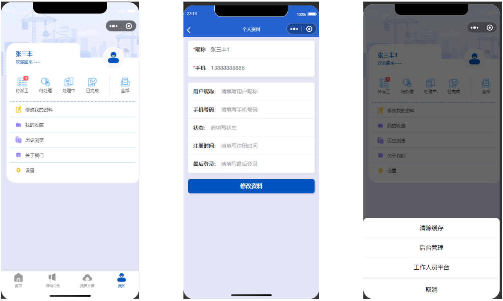

# sx002
> 基于云函数的巡检隐患上报系统微信小程序。这是一个基于微信小程序云开发技术构建的企业级巡检和隐患上报管理系统，专为工厂车间、仓库货物、企业管道阀门、制造车间、施工现场、塔吊升降机、施工围挡、高速公路、铁路设备、车辆安全、港口船舶设施、小区物业设施、学校教学楼实验室、医院医疗设备、商场消防通道等场景设计。
## 前端技术
- 微信小程序原生开发：采用微信小程序原生框架，确保最佳性能和用户体验
- 模块化组件设计：内置丰富的UI组件库，包括表单、日历、文件上传、图片处理等
- 响应式布局：支持多种设备尺寸，适配不同屏幕
- 自定义导航栏：提供灵活的导航体验
## 后端架构
- 微信云开发：基于腾讯云开发平台，无需服务器运维
- 云函数架构：采用MVC设计模式，支持RESTful API
- 云数据库：使用微信云数据库，支持实时数据同步
- 云存储：支持图片、文件等多媒体资源存储

## 获取方式
[戳我查看](https://gitee.com/aven999/mall)
